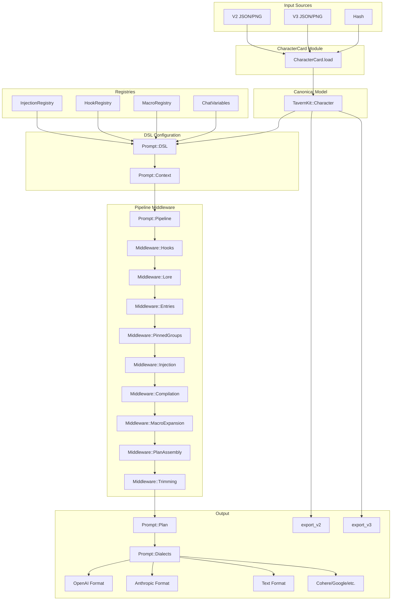

# TavernKit Architecture

This document describes the internal architecture, design decisions, and module responsibilities of TavernKit.

## Design Philosophy

TavernKit aims to be:

1. **SillyTavern-compatible** — Same concepts, similar behavior, familiar to ST users
2. **Ruby-idiomatic** — Clean API, proper encapsulation, good documentation
3. **Incrementally adoptable** — Use what you need, ignore what you don't
4. **Extensible** — Easy to add custom macros, prompt entries, hooks, and integrations
5. **V3-First** — Internal representation uses V3 superset, with V2/V3 import/export

## Repository Boundaries (Gem vs Playground)

This repository contains:

- `lib/tavern_kit/`: the **TavernKit gem** (framework-agnostic)
- `playground/`: a **Rails app** used as an end-to-end integration/reference implementation

Playground conventions (to keep the Rails↔Gem boundary clean):

- **Adapters live in Rails**: convert ActiveRecord models into pure TavernKit domain objects via `playground/app/services/prompt_building/` (e.g., `PromptBuilding::CharacterAdapter`, `PromptBuilding::ParticipantAdapter`).
- **Avoid model namespace collisions**: service namespaces that would read like models use plurals (e.g., `Conversations::*` services vs the `Conversation` ActiveRecord model).

For Rails-side details, see `docs/playground/PLAYGROUND_ARCHITECTURE.md`.

## Module Overview

```
TavernKit
├── GENERATION_TYPES        # Constant: [:normal, :continue, :impersonate, :swipe, :regenerate, :quiet]
├── Character               # Canonical character model (V3 superset)
├── CharacterCard           # Load/export module (V2↔V3↔Character)
├── User                    # User/persona representation (implements Participant)
├── Participant             # Interface module for chat participants
├── ChatHistory             # Type-safe chat history storage
│   ├── Base                # Abstract base class (interface)
│   └── InMemory            # Default array-backed implementation
├── ChatVariables           # Type-safe variable storage for macros
│   ├── Base                # Abstract base class (interface)
│   └── InMemory            # Default Hash-backed implementation
├── Png::Parser             # PNG/APNG text chunk extraction
├── Png::Writer             # PNG text chunk embedding (dual V2+V3 write)
├── Macro::SillyTavernV1::Engine  # {{placeholder}} expansion engine (multi-pass)
├── Macro::SillyTavernV2::Engine  # Parser-based macro engine (Macros 2.0 / nesting)
├── Macro::Invocation       # Call-site object for parameterized macros
├── Macro::Phase            # Multi-pass macro processing phase
├── Macro::Environment      # Extensible macro environment
├── MacroRegistry           # Global/custom macro registration
├── MacroContext            # Context passed to custom macro handlers
├── Instruct                # Instruct mode settings (sequences, wrapping, names behavior)
├── ContextTemplate         # Context template settings (story string, chat start, separators)
├── Preset                  # Global prompt configuration + Prompt Manager settings
├── Prompt::Message         # Single message (role + content + optional name)
├── Prompt::Block           # Extended block with id, priority, budget group, enabled flag
├── Prompt::Plan            # Final assembled prompt (block array + trim report + warnings)
├── Prompt::Context         # Immutable context flowing through middleware pipeline
├── Prompt::Pipeline        # Middleware orchestrator (Rack-like architecture)
├── Prompt::DSL             # Ruby-style DSL for prompt building configuration
├── Prompt::Middleware      # Middleware components for pipeline stages
│   ├── Base                # Abstract middleware base class
│   ├── Hooks               # Before/after build hooks
│   ├── Lore                # World Info evaluation
│   ├── Entries             # Prompt entry processing
│   ├── PinnedGroups        # Pinned group content building
│   ├── Injection           # In-chat and relative injections
│   ├── Compilation         # Block compilation from entries
│   ├── MacroExpansion      # Macro placeholder expansion
│   ├── PlanAssembly        # Final plan assembly
│   └── Trimming            # Context trimming
├── Prompt::PromptEntry     # Prompt Manager entry (pinned/custom, in-chat/relative, conditions)
├── Prompt::Trimmer         # Context trimming (examples → lore → history)
├── Prompt::ExampleParser   # Parse mes_example into message blocks
├── Prompt::Dialects        # Output format converters (OpenAI, Anthropic, Cohere, etc.)
├── InjectionRegistry       # Programmatic prompt injections (STscript /inject)
├── HookRegistry            # Build-time hooks (before_build, after_build)
├── HookContext             # Context object passed to hooks
├── Lore::Book              # World Info / Character Book container (with source tracking)
├── Lore::Entry             # Single lorebook entry (with optional filter, timed effects)
├── Lore::Engine            # Keyword matching, activation, budget, recursion, timed effects
├── Lore::Result            # Evaluation result with insertion strategies
├── Lore::KeyList           # Smart comma-separated key parsing
├── TokenEstimator          # Token estimation (tiktoken_ruby default, CharDiv4 for testing)
├── Utils                   # Shared helpers
└── Errors                  # Exception hierarchy
```

## Data Flow



## Key Components

### TavernKit::Character

**Responsibility**: Canonical internal representation of a roleplay character.

**Design Notes**:
- Uses `Data.define` for immutable data with IDE autocompletion
- Contains all fields from both V2 and V3 specs (V3 superset)
- `source_version` tracks original format (`:v2`, `:v3`, or `nil`)
- `raw` preserves original hash for debugging/round-tripping
- Implements `Participant` interface (can act as user in AI-to-AI chats)
- Design principle: "lenient in, strict out"

**Fields** (V3 superset):

| Field | Source | Description |
|-------|--------|-------------|
| `name` | V2 | Character's display name (required) |
| `description` | V2 | Character's description/backstory |
| `personality` | V2 | Character's personality traits |
| `scenario` | V2 | The roleplay scenario/setting |
| `first_mes` | V2 | First message (greeting) |
| `mes_example` | V2 | Example dialogue |
| `creator_notes` | V2 | Notes from the card creator |
| `system_prompt` | V2 | Custom system prompt override |
| `post_history_instructions` | V2 | Jailbreak/PHI content |
| `alternate_greetings` | V2 | Array of alternative first messages |
| `character_book` | V2 | Embedded lorebook/world info |
| `tags` | V2 | Array of tags for categorization |
| `creator` | V2 | Card creator's name |
| `character_version` | V2 | Version string for the character |
| `extensions` | V2 | Hash for storing extension data |
| `group_only_greetings` | V3 | Greetings only shown in group chats |
| `assets` | V3 | Array of asset objects (images, etc.) |
| `nickname` | V3 | Character's nickname |
| `creator_notes_multilingual` | V3 | Localized creator notes |
| `source` | V3 | Array of source URLs/references |
| `creation_date` | V3 | Unix timestamp of creation |
| `modification_date` | V3 | Unix timestamp of last modification |

**Usage**:
```ruby
# Load from file (auto-detects V2/V3)
character = TavernKit::CharacterCard.load("card.png")
character.data.name           # => "Seraphina"
character.source_version      # => :v2 or :v3

# Create programmatically
character = TavernKit::Character.create(
  name: "Nova",
  description: "A starship captain",
  personality: "Brave, curious"
)

# Character can act as user (AI-to-AI conversations)
alice = TavernKit::CharacterCard.load("alice.png")
bob = TavernKit::CharacterCard.load("bob.png")
plan = TavernKit.build(character: alice, user: bob, message: "Hello!")
```

### TavernKit::CharacterCard

**Responsibility**: Load characters from various sources and export to V2/V3 formats.

**Design Notes**:
- Single module with `load`, `export_v2`, `export_v3`, `write_to_png` methods
- Auto-detects V1/V2/V3 from input hash
- V1 cards are detected but rejected with `UnsupportedVersionError`
- Handles PNG, JSON files, JSON strings, and Hash inputs
- V3→V2 export preserves V3-only fields in `extensions["cc_extractor/v3"]`
- V2→V3 export upgrades lorebook entries (adds `use_regex` boolean)

**Methods**:

| Method | Description |
|--------|-------------|
| `load(input)` | Load from PNG/JSON file, JSON string, or Hash → Character |
| `export_v2(character, preserve_v3_fields: true)` | Export to V2 spec-compliant Hash |
| `export_v3(character)` | Export to V3 spec-compliant Hash |
| `write_to_png(character, input_png:, output_png:, format:)` | Embed character in PNG |
| `detect_version(hash)` | Returns `:v1`, `:v2`, `:v3`, or `:unknown` |

**Usage**:
```ruby
# Load from any source
character = TavernKit::CharacterCard.load("card.png")
character = TavernKit::CharacterCard.load("card.json")
character = TavernKit::CharacterCard.load(hash)

# Or use convenience method
character = TavernKit.load_character("card.png")

# Export to specific version
v2_hash = TavernKit::CharacterCard.export_v2(character)
v3_hash = TavernKit::CharacterCard.export_v3(character)

# Write to PNG (dual V2+V3 by default)
TavernKit::CharacterCard.write_to_png(
  character,
  input_png: "base.png",
  output_png: "output.png",
  format: :both  # or :v2, :v3
)
```

### TavernKit::Participant

**Responsibility**: Interface for chat participants (users, characters acting as users).

**Design Notes**:
- Defines `name` and `persona_text` methods
- Enables Character objects to act as users in AI-to-AI conversations
- Both `User` and `Character` implement this interface

**Usage**:
```ruby
# Traditional user
user = TavernKit::User.new(name: "Alice", persona: "A curious adventurer")

# Character as user (AI-to-AI)
alice = TavernKit::CharacterCard.load("alice.png")
bob = TavernKit::CharacterCard.load("bob.png")
plan = TavernKit.build(
  character: alice,
  user: bob,  # Character implements Participant!
  message: "Hello!"
)
```

### TavernKit::ChatVariables

**Responsibility**: Type-safe storage for SillyTavern-style chat-local and global variable macros.

**Design Notes**:
- `ChatVariables::Base` — Abstract base class defining the interface contract
- `ChatVariables::InMemory` — Default Hash-backed implementation
- Used by `{{setvar::}}`, `{{getvar::}}`, `{{var::}}` macros
- Separate stores for chat-local and global variables
- Developers can implement custom storage backends (e.g., Redis, database)

**Usage**:
```ruby
# Default in-memory storage
vars = TavernKit::ChatVariables.new
vars["x"] = "foo"
vars["x"]  # => "foo"

# With DSL (persist across builds)
store = TavernKit::ChatVariables.new
plan = TavernKit.build do
  character my_character
  user my_user
  preset my_preset
  macro_vars local_store: store, global_store: global_store
  message "Hello!"
end

# Custom implementation (e.g., Redis-backed)
class RedisChatVariables < TavernKit::ChatVariables::Base
  def initialize(redis_key, redis: Redis.current)
    @redis = redis
    @key = redis_key
  end

  def get(key)
    @redis.hget(@key, coerce_key!(key))
  end

  def set(key, value)
    @redis.hset(@key, coerce_key!(key), stringify_value(value))
    value
  end
  # ... other methods
end
```

### Prompt::Pipeline

**Responsibility**: Orchestrate middleware execution for prompt construction using a Rack-like architecture.

**Design Notes**:
- Middleware chain pattern inspired by Rack and Faraday
- Each middleware processes a `Context` object and passes it to the next
- Default pipeline includes 9 core middleware components
- Fully customizable: replace, insert, or remove middleware
- Thread-safe with immutable context flow

**Default Middleware Stack**:

| Order | Middleware | Responsibility |
|-------|-----------|----------------|
| 1 | `Hooks` | Execute before_build hooks |
| 2 | `Lore` | Evaluate World Info entries |
| 3 | `Entries` | Process prompt entries |
| 4 | `PinnedGroups` | Build pinned group content |
| 5 | `Injection` | Handle in-chat injections |
| 6 | `Compilation` | Compile blocks from entries |
| 7 | `MacroExpansion` | Expand macro placeholders |
| 8 | `PlanAssembly` | Assemble final plan |
| 9 | `Trimming` | Context trimming |

**Usage**:
```ruby
# Use default pipeline
plan = TavernKit.build(character: char, user: user, message: "Hello!")

# Create custom pipeline
pipeline = TavernKit::Prompt::Pipeline.new do
  use TavernKit::Prompt::Middleware::Hooks
  use TavernKit::Prompt::Middleware::Lore
  use MyCustomMiddleware  # Insert custom middleware
  use TavernKit::Prompt::Middleware::Entries
  # ... rest of middleware
end

plan = TavernKit.build(pipeline: pipeline, character: char, user: user, message: "Hello!")
```

### Prompt::Context

**Responsibility**: Immutable context object that flows through middleware pipeline.

**Design Notes**:
- Contains all inputs and intermediate state
- Each middleware receives context and returns a new/modified context
- Supports `with` pattern for creating modified copies
- Tracks processing stages and results

**Key Fields**:

| Field | Type | Description |
|-------|------|-------------|
| `character` | `Character` | Character card |
| `user` | `Participant` | User participant |
| `preset` | `Preset` | Preset configuration |
| `history` | `ChatHistory` | Chat history |
| `user_message` | `String` | Current user input |
| `lore_books` | `Array<Lore::Book>` | Global lore books |
| `lore_result` | `Lore::Result` | Evaluated lore entries |
| `prompt_entries` | `Array<PromptEntry>` | Filtered prompt entries |
| `pinned_groups` | `Hash` | Built pinned group blocks |
| `blocks` | `Array<Block>` | Compiled blocks |
| `plan` | `Plan` | Final assembled plan |

### Prompt::DSL

**Responsibility**: Ruby-style DSL for configuring prompt builds.

**Design Notes**:
- Fluent API for setting inputs
- Block-style configuration support
- Automatic type coercion
- Pipeline customization methods

**Usage**:
```ruby
# Block style (recommended)
plan = TavernKit.build do
  character my_char
  user my_user
  preset my_preset
  history chat_history
  lore_books [world_info]
  message "Hello!"
end

# Method chaining
dsl = TavernKit::Prompt::DSL.new
  .character(my_char)
  .user(my_user)
  .message("Hello!")
plan = dsl.build

# With middleware customization
plan = TavernKit.build do
  character my_char
  user my_user

  # Add custom middleware
  use MyCustomMiddleware

  # Replace existing middleware
  replace :trimming, MyTrimmer

  # Insert middleware at specific position
  insert_before :compilation, MyPreprocessor

  message "Hello!"
end

# Direct class method
plan = TavernKit::Prompt::DSL.build do
  character my_char
  user my_user
  message "Hello!"
end

# Convert directly to messages
messages = TavernKit.to_messages(dialect: :openai) do
  character my_char
  user my_user
  message "Hello!"
end
```

### Prompt::Middleware

**Responsibility**: Base class and standard middleware for pipeline stages.

**Middleware Interface**:
```ruby
class MyMiddleware < TavernKit::Prompt::Middleware::Base
  # Called before next middleware
  def before(context)
    # Process and return modified context
    context.with(my_data: computed_value)
  end

  # Called after next middleware returns
  def after(context)
    # Post-process context
    context
  end
end
```

**Built-in Middleware**:

| Middleware | Purpose |
|-----------|---------|
| `Hooks` | Execute before_build/after_build hooks |
| `Lore` | Load lorebooks, evaluate World Info |
| `Entries` | Filter and categorize prompt entries |
| `PinnedGroups` | Build content for pinned slots |
| `Injection` | Process in-chat and relative injections |
| `Compilation` | Compile entries to blocks |
| `MacroExpansion` | Expand `{{macro}}` placeholders |
| `PlanAssembly` | Create final `Prompt::Plan` |
| `Trimming` | Enforce token budget |

**Creating Custom Middleware**:
```ruby
class LoggingMiddleware < TavernKit::Prompt::Middleware::Base
  def before(context)
    Rails.logger.info "Building prompt for #{context.character.name}"
    context
  end

  def after(context)
    Rails.logger.info "Plan has #{context.plan&.blocks&.size || 0} blocks"
    context
  end
end

# Use in pipeline
plan = TavernKit.build do
  use LoggingMiddleware
  character my_char
  user my_user
  message "Hello!"
end
```

### TavernKit::InjectionRegistry

**Responsibility**: Per-chat/per-builder registry for programmatic prompt injections.

**Design Notes**:
- Mirrors SillyTavern's STscript `/inject` feature
- `register(id:, content:, position:, **options)` / `remove(id:)`
- Overlapping ID = replace
- Positions: `before` / `after` / `chat` / `none`
- Options: `depth`, `role`, `scan`, `filter`, `ephemeral`
- `scan=true` injects are included in World Info scanning even when `position=none`

**Usage**:
```ruby
# Register an injection via DSL
plan = TavernKit.build do
  character my_character
  user my_user

  injection id: "my_inject",
            content: "Important context",
            position: :chat,
            depth: 2,
            role: :system,
            scan: true,       # Include in WI scanning
            ephemeral: true   # Remove after one build

  message "Hello!"
end

# Or use InjectionRegistry directly
registry = TavernKit::InjectionRegistry.new
registry.register(
  id: "my_inject",
  content: "Important context",
  position: :chat,
  depth: 2,
  role: :system
)
registry.remove(id: "my_inject")
```

### TavernKit::HookRegistry & HookContext

**Responsibility**: Per-builder registry for build-time hooks.

**Design Notes**:
- `before_build` — Modify inputs before prompt assembly (character, user, history, user_message)
- `after_build` — Modify plan after assembly but before trimming
- Hooks receive `HookContext` with full build state
- Hooks run in registration order; errors propagate

**Usage**:
```ruby
# DSL-level hooks (recommended)
plan = TavernKit.build do
  character my_character
  user my_user
  preset my_preset

  before_build do |ctx|
    ctx.user_message = ctx.user_message.to_s.strip
  end

  after_build do |ctx|
    ctx.plan.blocks.unshift(TavernKit::Prompt::Block.new(role: :system, content: "HOOKED"))
  end

  message "Hello"
end

# Registry-level (share hooks across builds)
hooks = TavernKit::HookRegistry.new
hooks.before_build { |ctx| ctx.user_message = "overridden" }

plan = TavernKit.build do
  character my_character
  user my_user
  preset my_preset
  hook_registry hooks
  message "Hello"
end
```

**HookContext Fields**:

| Field | Mutable | Description |
|-------|---------|-------------|
| `character` | ✅ (before_build) | Current character |
| `user` | ✅ (before_build) | Current user |
| `history` | ✅ (before_build) | Chat history |
| `user_message` | ✅ (before_build) | Current user input |
| `preset` | ❌ | Current preset |
| `generation_type` | ❌ | Generation type (:normal, :continue, etc.) |
| `injection_registry` | ❌ | InjectionRegistry reference |
| `macro_vars` | ❌ | Macro variables hash |
| `group` | ❌ | Group context (if any) |
| `plan` | ✅ (after_build) | The assembled Prompt::Plan |

### Macro::SillyTavernV1::Engine

**Responsibility**: Replace `{{placeholder}}` patterns with actual values.

**Design Notes**:
- Case-insensitive matching (`{{char}}` = `{{CHAR}}` = `{{Char}}`)
- Multi-pass evaluation (pre-env → env → post-env) for nested macro support
- Unknown macros are kept as-is by default (configurable via `unknown:` option)
- Supports Proc values for lazy evaluation
- Optional `clock:` and `rng:` for deterministic time/random macros in tests
- Built-in ST macros via registries (`TavernKit::Macro::Packs::SillyTavern`)
- Parameterized macros receive `TavernKit::Macro::Invocation` for parsing/utility helpers

**Supported Macros**:

| Category | Macros |
|----------|--------|
| Identity | `{{char}}`, `{{user}}`, `{{persona}}`, `{{charIfNotGroup}}`, `{{group}}`, `{{groupNotMuted}}`, `{{notChar}}` |
| Character | `{{description}}`, `{{personality}}`, `{{scenario}}`, `{{charPrompt}}`, `{{charJailbreak}}`, `{{charInstruction}}`, `{{charVersion}}`, `{{charDepthPrompt}}`, `{{creatorNotes}}` |
| Examples | `{{mesExamples}}`, `{{mesExamplesRaw}}` |
| Conversation | `{{lastMessage}}`, `{{lastUserMessage}}`, `{{lastCharMessage}}`, `{{lastMessageId}}`, `{{firstIncludedMessageId}}`, `{{idle_duration}}` |
| System | `{{input}}`, `{{maxPrompt}}`, `{{original}}`, `{{systemPrompt}}`, `{{globalSystemPrompt}}` |
| Instruct Mode | `{{instructInput}}`, `{{instructOutput}}`, `{{instructSystem}}`, `{{instructInputSuffix}}`, `{{instructOutputSuffix}}`, `{{instructSystemSuffix}}`, `{{instructFirstInput}}`, `{{instructFirstOutput}}`, `{{instructLastInput}}`, `{{instructLastOutput}}`, `{{instructStoryStringPrefix}}`, `{{instructStoryStringSuffix}}` |
| Context Template | `{{chatStart}}`, `{{chatSeparator}}` |
| Date/Time | `{{date}}`, `{{time}}`, `{{weekday}}`, `{{isodate}}`, `{{isotime}}`, `{{datetimeformat ...}}`, `{{time_UTC±N}}`, `{{timeDiff::a::b}}` |
| Random/Dice | `{{random::a,b,c}}`, `{{pick::a,b,c}}`, `{{roll:dN}}` |
| Variables | `{{setvar::name::value}}`, `{{getvar::name}}`, `{{var::name}}`, `{{addvar::...}}`, `{{incvar::...}}`, `{{decvar::...}}` (+ global variants) |
| Utilities | `{{newline}}`, `{{trim}}`, `{{noop}}`, `{{reverse:...}}`, `{{// ... }}`, `{{banned "..."}}` |
| World Info | `{{outlet::name}}` |

### Macro::SillyTavernV2::Engine

**Responsibility**: Provide a **parser-based** macro expander that targets SillyTavern's
experimental **MacroEngine / "Macros 2.0"** behavior.

Unlike `Macro::SillyTavernV1::Engine` (legacy multi-pass regex expansion), `Macro::SillyTavernV2::Engine`:
- Supports **true nesting inside macro arguments** (e.g., `{{outer::{{inner}}}}`) with
  a stable, depth-first evaluation order.
- Preserves **unknown macros** while still expanding any **nested known macros inside** them.
- Uses **original-input offsets** when building `Macro::Invocation`, improving determinism
  for macros like `{{pick}}`.
- Post-processes `{{trim}}` and unescapes `\{` / `\}`.

**Integration**:
- The public API matches `Macro::SillyTavernV1::Engine` (`expand(text, vars = {}, allow_outlets: ...)`).
- Macro implementations remain pluggable via the same env/builtins registries.
- `Macro::SillyTavernV2::Engine` is the default expander used by the Prompt DSL; switch to legacy via `macro_engine :silly_tavern_v1` (or set `expander TavernKit::Macro::SillyTavernV1::Engine.new`).

### Instruct

**Responsibility**: Hold SillyTavern Instruct Mode settings for text completion prompts.

**Design Notes**:
- Mirrors ST's `power_user.instruct` settings structure
- Provides input/output/system sequences with first/last variants
- Supports wrap and names_behavior configuration
- Generates stop sequences from configured sequences

**Key Fields**:

| Field | Type | Description |
|-------|------|-------------|
| `enabled` | Boolean | Enable instruct mode formatting |
| `input_sequence` | String | Sequence before user messages |
| `output_sequence` | String | Sequence before assistant messages |
| `system_sequence` | String | Sequence before system messages |
| `*_suffix` | String | Suffix after messages of each type |
| `first_*_sequence` | String | Override for first message of each type |
| `last_*_sequence` | String | Override for last message of each type |
| `story_string_prefix` | String | Prefix for story string |
| `story_string_suffix` | String | Suffix for story string |
| `stop_sequence` | String | Explicit stop sequence |
| `wrap` | Boolean | Wrap messages with newlines |
| `names_behavior` | Symbol | `:force`, `:remove`, or `:default` |
| `sequences_as_stop_strings` | Boolean | Add sequences to stop strings |

**Names Behavior**:
- `:force` — Always include names in messages
- `:remove` — Never include names in messages
- `:default` — Include names for user/assistant, not for system

### ContextTemplate

**Responsibility**: Hold SillyTavern Context Template settings for story string assembly.

**Design Notes**:
- Mirrors ST's `power_user.context` settings structure
- Story string is a Handlebars template
- Supports configurable position, role, and depth
- Provides chat start and example separator strings

**Key Fields**:

| Field | Type | Description |
|-------|------|-------------|
| `story_string` | String | Handlebars template for story string |
| `chat_start` | String | Chat start marker (default: `"***"`) |
| `example_separator` | String | Example dialogue separator (default: `"***"`) |
| `use_stop_strings` | Boolean | Use stop strings from context |
| `names_as_stop_strings` | Boolean | Add participant names as stop strings |
| `story_string_position` | Integer | 0=in_prompt, 1=in_chat, 2=before_prompt |
| `story_string_role` | Integer | 0=system, 1=user, 2=assistant |
| `story_string_depth` | Integer | Depth when in_chat (default: 1) |

**Story String Rendering**:
- Uses Handlebars syntax for conditionals: `{{#if description}}...{{/if}}`
- Available variables: `system`, `description`, `personality`, `scenario`, `persona`, `char`

### Preset

**Responsibility**: Hold global/default prompt configuration and Prompt Manager settings.

**Design Notes**:
- Supports ordered `prompt_entries` array (Prompt Manager functionality)
- Context window settings: `context_window_tokens`, `reserved_response_tokens`
- Examples behavior: `:gradually_push_out`, `:always_keep`, `:disabled`
- Lore insertion strategy: `:sorted_evenly`, `:character_lore_first`, `:global_lore_first`
- Author's Note settings: frequency, position, depth, role
- World Info settings: depth, budget, min_activations, group_scoring
- Format templates: `wi_format`, `scenario_format`, `personality_format`
- Utility prompts: `new_chat_prompt`, `group_nudge_prompt`, `continue_prefill`, etc.
- Instruct mode: `instruct` (`TavernKit::Instruct`) for text completion formatting
- Context template: `context_template` (`TavernKit::ContextTemplate`) for story string assembly

**ST Preset JSON Loading**:
- `Preset.from_st_preset_json(hash)` — Load preset from SillyTavern preset JSON format
- `Preset.load_st_preset_file(path)` — Load preset from ST preset JSON file
- Handles nested `prompt_order` arrays, injection settings, numeric trigger codes

**SillyTavern Mapping**:

| Preset field | ST equivalent |
|--------------|---------------|
| `main_prompt` | System Prompt / Main Prompt |
| `post_history_instructions` | Post-History Instructions |
| `prefer_char_prompt` | "Prefer Char. Prompt" checkbox |
| `prefer_char_instructions` | "Prefer Char. Instruct" checkbox |
| `prompt_entries` | Prompt Manager entries list |
| `character_lore_insertion_strategy` | World Info → Character Lore Insertion Strategy |
| `context_window_tokens` | Context Size |
| `examples_behavior` | Examples behavior (trim/keep/disable) |
| `authors_note` | Author's Note content |
| `authors_note_frequency` | How often to insert AN (0=never, 1=always, N=every N) |
| `authors_note_position` | AN position (in_chat, in_prompt, before_prompt) |
| `authors_note_depth` | AN in-chat depth (default: 4) |
| `authors_note_role` | AN role (default: system) |
| `world_info_include_names` | Include speaker names in WI scan buffer |
| `world_info_depth` | Global WI scan depth (default: 2) |
| `world_info_budget` | WI budget as % of available context (default: 25%) |
| `world_info_min_activations` | Min entries to activate before increasing depth |
| `squash_system_messages` | Merge consecutive system messages (OpenAI) |

**Entry Normalization (ST-Aligned)**:
- `partition_prompt_entries` separates entries into `relative`, `in_chat`, and `forced_last` categories
- `FORCE_RELATIVE_IDS`: `chat_history`, `chat_examples` — Multi-block groups always relative
- `FORCE_LAST_IDS`: `post_history_instructions` — PHI always placed at very end

**In-Chat Injection Rules**:
- Depth calculation: Depth 0 = after last message, Depth 1 = before last, etc.
- Order grouping: `injection_order` (higher orders appear later / closer to the end)
- Role ordering within same depth+order: Assistant → User → System (fixed)
- Same role+depth+order merging: Entries combined into single message

### Prompt::PromptEntry

**Responsibility**: Model a single Prompt Manager entry (pinned or custom).

**Design Notes**:
- `id` — Unique identifier (matches pinned group IDs for built-ins)
- `pinned` — Whether this is a built-in (main_prompt, chat_history, etc.)
- `position` — `:relative` (drag & drop order) or `:in_chat` (inject into history)
- `depth` / `order` — For in-chat injection positioning
- `role` — Override role for the entry's content
- `content` — Custom text (for non-pinned entries)
- `forbid_overrides` — Blocks character-level overrides
- `triggers` — Array of generation types (empty = all types)
- `conditions` — Conditional activation (chat patterns, turn count, attributes)

**Conditional Entries**:
```ruby
# Enable when recent messages mention "dragon"
{ id: "dragon_lore", content: "...", conditions: { chat: { any: ["dragon"] } } }

# Enable every 5th turn
{ id: "reminder", content: "...", conditions: { turns: { every: 5 } } }

# Enable for specific character tags
{ id: "magic_prompt", content: "...", conditions: { character: { tags_any: ["magic"] } } }
```

**Pinned Group IDs**:
- `main_prompt`, `world_info_before_char_defs`, `persona_description`
- `character_description`, `character_personality`, `scenario`
- `world_info_after_char_defs`, `chat_examples`, `authors_note`
- `chat_history`, `post_history_instructions`, `enhance_definitions`, `auxiliary_prompt`

### Prompt::Block

**Responsibility**: Represent a single unit in a prompt plan with full metadata.

**Attributes**:

| Attribute | Type | Default | Description |
|-----------|------|---------|-------------|
| `id` | String | UUID | Unique identifier |
| `role` | Symbol | required | `:system`, `:user`, `:assistant` |
| `content` | String | required | Text content |
| `name` | String | `nil` | Optional speaker name |
| `slot` | Symbol | `nil` | Block type (`:main_prompt`, `:history`, etc.) |
| `enabled` | Boolean | `true` | Whether block is active |
| `insertion_point` | Symbol | `:relative` | Position enum |
| `depth` | Integer | `0` | For `:in_chat` insertion |
| `order` | Integer | `100` | Ordering within position |
| `priority` | Integer | `100` | Eviction priority (lower = keep) |
| `token_budget_group` | Symbol | `:default` | Budget group |
| `tags` | Array | `[]` | Filtering/hooks |
| `metadata` | Hash | `{}` | Extension data |

**Budget Groups** (eviction order):
- `:system` — Never evicted (main prompt, PHI)
- `:examples` — Evicted first
- `:lore` — Evicted second
- `:history` — Evicted last
- `:custom`, `:default` — Custom injections

### Prompt::Plan

**Responsibility**: Hold the final assembled prompt, provide output formats.

**Design Notes**:
- `blocks` returns ALL blocks including disabled (for debugging)
- `enabled_blocks` returns only enabled blocks
- `to_messages(dialect:, **opts)` outputs in different LLM provider formats
- `greeting` / `greeting_index` for selected first message (macros expanded)
- `warnings` collects non-fatal issues (unknown pinned IDs, etc.)
- `trim_report` contains eviction details after context trimming

**Output Dialects**:

| Dialect | Format | Options |
|---------|--------|---------|
| `:openai` | `[{role:, content:, name?:}]` | `squash_system_messages:`, `names:` |
| `:anthropic` | `{messages: [...], system: [...]}` | `assistant_prefill:`, `use_sys_prompt:`, `use_tools:`, `names:` |
| `:cohere` | `{chat_history: [...]}` | `names:` |
| `:google` | `{contents: [...], system_instruction: {...}}` | `use_tools:` |
| `:ai21` | `[{role:, content:}]` | — |
| `:mistral` | `[{role:, content:}]` | `use_prefix:` |
| `:xai` | `[{role:, content:}]` | `names:` |
| `:text` | `{prompt:, stop_sequences:}` | `instruct:`, `names:`, `wrap_names:`, `include_names:` |

### Prompt::Trimmer

**Responsibility**: Trim a Prompt::Plan to fit within token budget.

**Design Notes**:
- Uses Block's `token_budget_group` to determine eviction category
- Uses Block's `priority` to order eviction within groups
- Disables blocks in-place (sets `enabled: false`) rather than removing
- Eviction priority: Examples → Lore → History
- Examples evicted by `example_block` metadata (whole dialogues at once)
- History truncated from oldest, keeping the latest user message
- Returns detailed `trim_report` with what was removed

### Lore::Engine

**Responsibility**: Evaluate entries against scan text, manage token budget, merge multiple books.

**Design Notes**:
- Supports multiple books via `books:` parameter (character + global WI)
- Scans chat history up to `scan_depth` messages (0 = scan nothing)
- Supports recursive scanning (activated content triggers more entries)
- Token budget with priority-based selection
- Optional Filter logic (AND ANY/ALL, NOT ANY/ALL) for secondary keys
- Per-entry `match_*` flags for scan buffer augmentation
- Per-entry overrides for `caseSensitive` and `matchWholeWords`
- JS regex support via `js_regex_to_ruby` gem

**Timed Effects**:
- `sticky` — Entry remains active for N messages after triggering
- `cooldown` — Entry suppressed for N messages after triggering
- `delay` — Entry only activates after N chat messages

**Min Activations**:
- Increases scan depth until N entries activate or cap reached
- Controlled by `world_info_min_activations` and `world_info_min_activations_depth_max`

**Group Scoring**:
- `group` defines inclusion groups (comma-separated names)
- `groupOverride=true` entries win first (highest order)
- Otherwise weighted random by `groupWeight`
- Optional `world_info_use_group_scoring` for match-count-based filtering

**Forced Activations**:
- `Builder#force_world_info(...)` for external forced activation
- `ignoreBudget` entries bypass token budget cutoff

### TokenEstimator

**Responsibility**: Accurate token counting for budget enforcement.

**Design Notes**:
- `TiktokenRuby` — Default implementation using `tiktoken_ruby` gem for accurate OpenAI-style counting
- `CharDiv4` — Simple heuristic (~4 chars per token), available for testing only
- Used for World Info budget, context trimming, and plan token counting

**Encodings**:

| Encoding | Models |
|----------|--------|
| `cl100k_base` | GPT-4, GPT-3.5-turbo |
| `o200k_base` | GPT-4o models |
| `p50k_base` | Codex models |
| `r50k_base` | GPT-3 models (davinci, etc.) |

## Prompt Construction Pipeline

This section describes the complete flow of prompt construction, from input to output. The pipeline is implemented using a **middleware architecture** (`Prompt::Pipeline`) inspired by Rack and Faraday, providing full customizability at each stage.

### Pipeline Architecture

The pipeline uses a middleware pattern where each stage:
1. Receives an immutable `Prompt::Context` object
2. Processes it (optionally modifying via `context.with(...)`)
3. Passes it to the next middleware
4. Can perform post-processing after downstream middleware complete

```ruby
# Middleware interface
class MyMiddleware < TavernKit::Prompt::Middleware::Base
  def before(context)
    # Pre-processing: modify and return context
    context.with(my_data: computed_value)
  end

  def after(context)
    # Post-processing: context now includes results from downstream middleware
    context
  end
end
```

### Pipeline Overview

```
┌─────────────────────────────────────────────────────────────────────────────┐
│                     MIDDLEWARE PIPELINE ARCHITECTURE                         │
└─────────────────────────────────────────────────────────────────────────────┘

  ┌──────────────┐
  │  DSL / API   │  TavernKit.build { character ...; user ...; message ... }
  │              │  Creates Prompt::Context with inputs
  └──────┬───────┘
         │
         ▼
  ┌──────────────────────────────────────────────────────────────────────────┐
  │                         MIDDLEWARE STACK                                  │
  │                                                                           │
  │  ┌──────────┐   ┌──────────┐   ┌──────────┐   ┌──────────┐              │
  │  │  Hooks   │ → │   Lore   │ → │ Entries  │ → │ Pinned   │ → ...        │
  │  │ (before) │   │          │   │          │   │ Groups   │              │
  │  └──────────┘   └──────────┘   └──────────┘   └──────────┘              │
  │                                                                           │
  │  ... → ┌──────────┐   ┌──────────┐   ┌──────────┐   ┌──────────┐        │
  │        │Injection │ → │Compilation│ → │ Macro    │ → │  Plan    │ → ...  │
  │        │          │   │          │   │Expansion │   │ Assembly │        │
  │        └──────────┘   └──────────┘   └──────────┘   └──────────┘        │
  │                                                                           │
  │  ... → ┌──────────┐   ┌──────────┐                                       │
  │        │ Trimming │ → │  Hooks   │                                       │
  │        │          │   │ (after)  │                                       │
  │        └──────────┘   └──────────┘                                       │
  └──────────────────────────────────────────────────────────────────────────┘
         │
         ▼
  ┌──────────────┐
  │   OUTPUT     │  context.plan → Prompt::Plan
  │              │  plan.to_messages(dialect: :openai)
  └──────────────┘
```

### Middleware Components

| # | Middleware | Input | Output | Description |
|---|-----------|-------|--------|-------------|
| 1 | **Hooks** | context | context + hook results | Execute `before_build` hooks |
| 2 | **Lore** | context | context + `lore_result` | Evaluate World Info entries |
| 3 | **Entries** | context | context + `prompt_entries` | Filter/categorize prompt entries |
| 4 | **PinnedGroups** | context | context + `pinned_groups` | Build pinned group content |
| 5 | **Injection** | context | context + in-chat blocks | Process injections |
| 6 | **Compilation** | context | context + `blocks` | Compile entries to blocks |
| 7 | **MacroExpansion** | context | context + expanded blocks | Expand `{{macro}}` placeholders |
| 8 | **PlanAssembly** | context | context + `plan` | Create `Prompt::Plan` |
| 9 | **Trimming** | context | context + trimmed plan | Enforce token budget |

### Detailed Stage Descriptions

```
┌─────────────────────────────────────────────────────────────────────────────┐
│                         PROMPT CONSTRUCTION STAGES                          │
└─────────────────────────────────────────────────────────────────────────────┘

  ┌──────────────┐
  │   INPUTS     │  character, user, preset, history, lore_books,
  │              │  user_message, generation_type, group, macro_vars
  └──────┬───────┘
         │
         ▼
  ┌──────────────┐
  │ 1. HOOKS     │  before_build hooks (modify inputs)
  │   (before)   │  ├─ ctx.character, ctx.user
  │              │  ├─ ctx.history, ctx.user_message
  │              │  └─ Validation: character/user required
  └──────┬───────┘
         │
         ▼
  ┌──────────────┐
  │ 2. LORE      │  World Info / Lorebook Evaluation
  │   ENGINE     │  ├─ Load character book + global lore books
  │              │  ├─ Build scan buffer (history + user_message)
  │              │  ├─ Evaluate keywords → activated entries
  │              │  ├─ Apply token budget + priority selection
  │              │  └─ Output: Lore::Result with outlets
  └──────┬───────┘
         │
         ▼
  ┌──────────────┐
  │ 3. PROMPT    │  Filter & Normalize Prompt Manager Entries
  │   ENTRIES    │  ├─ Filter by generation_type triggers
  │              │  ├─ Filter by conditional activation (chat/turns/character)
  │              │  ├─ Apply Author's Note parity controls
  │              │  └─ Separate: relative / in_chat / forced_last
  └──────┬───────┘
         │
         ▼
  ┌──────────────┐
  │ 4. PINNED    │  Build Pinned Group Content
  │   GROUPS     │  ├─ main_prompt, persona_description
  │              │  ├─ character_description, personality, scenario
  │              │  ├─ chat_examples (parsed → message blocks)
  │              │  ├─ chat_history (history → message blocks)
  │              │  ├─ world_info_* positions (8 positions)
  │              │  └─ authors_note, enhance_definitions, auxiliary_prompt
  └──────┬───────┘
         │
         ▼
  ┌──────────────┐
  │ 5. IN-CHAT   │  Inject Content into Chat History
  │   INJECTION  │  ├─ In-chat prompt entries (depth/order)
  │              │  ├─ World Info at-depth entries
  │              │  ├─ InjectionRegistry chat injections
  │              │  ├─ Sort by: depth → order → role
  │              │  └─ Merge same depth+order+role blocks
  └──────┬───────┘
         │
         ▼
  ┌──────────────┐
  │ 6. BLOCK     │  Compile Final Block Array
  │   COMPILATION│  ├─ Walk relative entries in order
  │              │  ├─ Expand pinned groups inline
  │              │  ├─ Apply macro expansion to all content
  │              │  ├─ Append forced_last (PHI)
  │              │  ├─ Append continue blocks (if :continue)
  │              │  └─ Apply InjectionRegistry before/after blocks
  └──────┬───────┘
         │
         ▼
  ┌──────────────┐
  │ 7. PLAN      │  Create Prompt::Plan
  │   ASSEMBLY   │  ├─ blocks: Array<Prompt::Block>
  │              │  ├─ outlets: Hash (World Info outlets)
  │              │  ├─ lore_result: Lore::Result
  │              │  ├─ greeting: resolved greeting text
  │              │  └─ warnings: Array<String>
  └──────┬───────┘
         │
         ▼
  ┌──────────────┐
  │ 8. HOOKS     │  after_build hooks (modify plan)
  │   (after)    │  ├─ ctx.plan.blocks manipulation
  │              │  └─ Add/remove/reorder blocks
  └──────┬───────┘
         │
         ▼
  ┌──────────────┐
  │ 9. CONTEXT   │  Trim to Fit Token Budget
  │   TRIMMING   │  ├─ Evict examples (by examples_behavior)
  │              │  ├─ Evict lore (by priority)
  │              │  ├─ Truncate history (oldest first)
  │              │  └─ Preserve: system prompts, latest user message
  └──────┬───────┘
         │
         ▼
  ┌──────────────┐
  │ 10. OUTPUT   │  Convert to LLM Provider Format
  │   DIALECTS   │  ├─ plan.to_messages(dialect: :openai)
  │              │  ├─ plan.to_messages(dialect: :anthropic)
  │              │  └─ ... (8 supported dialects)
  └──────────────┘
```

### Stage 1: Before-Build Hooks

**Purpose**: Allow external code to modify inputs before prompt assembly.

```ruby
# HookContext fields available in before_build:
ctx.character      # [mutable] Character instance
ctx.user           # [mutable] User instance
ctx.history        # [mutable] ChatHistory
ctx.user_message   # [mutable] Current user input string
ctx.preset         # [read-only] Preset
ctx.generation_type # [read-only] :normal, :continue, etc.
ctx.injection_registry # [read-only] InjectionRegistry
ctx.macro_vars     # [read-only] Macro variables hash
ctx.group          # [read-only] Group context
```

**Example Use Cases**:
- Input sanitization (trim whitespace, filter content)
- Dynamic character/user swapping
- History preprocessing

### Stage 2: Lore Engine Evaluation

**Purpose**: Activate World Info entries based on keyword matching.

**Process**:
1. **Load Books**: Character book + global lore books
2. **Build Scan Buffer**: Recent history messages + user message
3. **Keyword Matching**: Primary keys (ANY), secondary keys (Optional Filter logic)
4. **Timed Effects**: Sticky/cooldown/delay processing
5. **Min Activations**: Increase scan depth if needed
6. **Group Scoring**: Inclusion groups, override logic, weighted random
7. **Token Budget**: Priority-based selection within budget

**Output**: `Lore::Result` containing:
- `selected`: Array of activated entries
- `outlets`: Hash mapping outlet names to content
- `by_position`: Entries grouped by insertion position

### Stage 3: Prompt Entry Processing

**Purpose**: Filter and categorize Prompt Manager entries.

**Filtering**:
```ruby
# Generation type triggers
entry.triggered_by?(:normal)  # Empty triggers = all types
entry.triggered_by?(:continue) # Specific trigger check

# Conditional activation
entry.active_for?(conditions_context)
# - chat: { any: ["keyword"], all: [...], none: [...] }
# - turns: { eq: N, gte: N, every: N }
# - character: { tags_any: [...], tags_all: [...] }
```

**Normalization Categories**:
- `relative`: Standard drag-and-drop ordered entries
- `in_chat`: Entries injected at specific depth in history
- `forced_last`: PHI (Post-History Instructions) always last

**Special Rules**:
- `FORCE_RELATIVE_IDS`: `chat_history`, `chat_examples` (multi-block groups)
- `FORCE_LAST_IDS`: `post_history_instructions`

### Stage 4: Pinned Group Construction

**Purpose**: Build content for built-in prompt slots.

**Pinned Group IDs and Content Sources**:

| ID | Content Source | Macro Expansion |
|----|----------------|-----------------|
| `main_prompt` | `preset.main_prompt` or `character.system_prompt` | ✅ |
| `persona_description` | `user.persona` | ✅ |
| `character_description` | `character.description` | ✅ |
| `character_personality` | `character.personality` | ✅ |
| `scenario` | `character.scenario` | ✅ |
| `chat_examples` | `character.mes_example` → parsed messages | ✅ |
| `chat_history` | `history` + `user_message` → message blocks | ❌ (raw) |
| `authors_note` | `preset.authors_note` or overrides | ✅ |
| `post_history_instructions` | `preset.post_history_instructions` or `character.post_history_instructions` | ✅ |
| `world_info_before_char_defs` | Lore entries (position 0) | ✅ |
| `world_info_after_char_defs` | Lore entries (position 1) | ✅ |
| ... | (8 World Info positions total) | ✅ |

**Format Templates**:
```ruby
# Applied via preset settings
preset.wi_format           # "{{key}}: {{content}}"
preset.scenario_format     # "Scenario: {{scenario}}"
preset.personality_format  # "{{char}}'s personality: {{personality}}"
```

### Stage 5: In-Chat Injection

**Purpose**: Insert content at specific depths within chat history.

**Injection Sources**:
1. In-chat prompt entries (`position: :in_chat`)
2. World Info at-depth entries (`position: :at_depth_N`)
3. InjectionRegistry chat injections (`position: :chat`)

**Positioning Algorithm**:
```
Depth 0 = After last message (end of history)
Depth 1 = Before last message
Depth 2 = Before second-to-last message
...
```

**Ordering Within Same Depth**:
1. Sort by `order` (ascending, default: 100)
2. Within same order, sort by role: Assistant → User → System
3. Merge same depth + order + role into single message

**Block Metadata**:
```ruby
Block.new(
  role: :system,
  content: "...",
  slot: :in_chat_inject,
  insertion_point: :in_chat,
  depth: 2,
  order: 100,
  # ...
)
```

### Stage 6: Block Compilation

**Purpose**: Assemble final ordered array of Prompt::Block objects.

**Process**:
1. Walk `relative` entries in Prompt Manager order
2. For each pinned entry: expand to its block(s)
3. For each custom entry: create block from content
4. Apply macro expansion to all content fields
5. Append `forced_last` entries (PHI)
6. Append continue blocks (for `:continue` generation)
7. Apply InjectionRegistry `before`/`after` relative blocks

**Macro Expansion Context**:
```ruby
{
  char: character.name,
  user: user.name,
  persona: user.persona_text,
  description: character.description,
  # ... (50+ macros)
  "outlet::name" => outlets["name"],
}
```

### Stage 7: Plan Assembly

**Purpose**: Create the final `Prompt::Plan` object.

**Plan Contents**:
```ruby
Plan.new(
  blocks: blocks,           # Array<Prompt::Block>
  outlets: outlets,         # Hash (WI outlets)
  lore_result: lore_result, # Lore::Result (activated entries)
  greeting: resolved_greeting,
  greeting_index: greeting_index,
  warnings: warnings        # Array<String>
)
```

### Stage 8: After-Build Hooks

**Purpose**: Allow external code to modify the assembled plan.

```ruby
# HookContext fields available in after_build:
ctx.plan  # [mutable] The assembled Prompt::Plan
# All other fields are read-only at this stage
```

**Example Use Cases**:
- Add custom header/footer blocks
- Remove specific blocks by slot/tag
- Reorder blocks
- Log/debug the assembled plan

### Stage 9: Context Trimming

**Purpose**: Ensure prompt fits within LLM context window.

**Eviction Order** (ST-aligned):
1. **Examples** (`:examples` budget group) — based on `examples_behavior`:
   - `:disabled`: Remove all examples first
   - `:gradually_push_out` / `:trim`: Remove by priority until fits
   - `:always_keep`: Never remove examples
2. **Lore** (`:lore` budget group) — by priority (lower = keep)
3. **History** (`:history` budget group) — oldest messages first

**Protected Content**:
- System prompts (`:system` budget group)
- Latest user message (never evicted)
- Low-priority blocks (lower priority number = more important)

**Trim Report**:
```ruby
{
  trimmed: true,
  max_tokens: 8000,
  total_tokens_before: 12000,
  total_tokens_after: 7800,
  removed_example_blocks: [...],
  removed_lore_uids: [...],
  removed_history_messages: 5,
  fits: true
}
```

### Stage 10: Output Formatting

**Purpose**: Convert plan to LLM provider-specific format.

**Conversion Process**:
```ruby
plan.to_messages(dialect: :openai, **opts)
```

1. Get enabled blocks: `plan.enabled_blocks`
2. Merge adjacent in-chat blocks with same role
3. Optionally squash consecutive system messages (OpenAI)
4. Convert blocks to messages: `block.to_message`
5. Apply dialect-specific transformations

**Dialect-Specific Behavior**:

| Dialect | System Handling | Message Format |
|---------|-----------------|----------------|
| `:openai` | Inline system messages | `[{role:, content:, name?:}]` |
| `:anthropic` | Extract to `system` array | `{messages:, system:}` |
| `:google` | Extract to `system_instruction` | `{contents:, system_instruction:}` |
| `:cohere` | Embed in user messages | `{chat_history:}` |
| `:text` | Prefix with role label, instruct sequences | `{prompt:, stop_sequences:}` |

### Complete Pipeline Example

```ruby
# 1. Setup
my_user = TavernKit::User.new(name: "Alice", persona: "A curious traveler")
card = TavernKit.load_character("card.png")
my_preset = TavernKit::Preset.new(
  main_prompt: "Write {{char}}'s next reply...",
  context_window_tokens: 8000,
  reserved_response_tokens: 1000
)
lore = TavernKit::Lore::Book.load_file("world_info.json", source: :global)
chat_history = TavernKit::ChatHistory.new(previous_messages)

# 2. Build with DSL
plan = TavernKit.build do
  character card
  user my_user
  preset my_preset
  lore_books [lore]
  history chat_history

  before_build { |ctx| ctx.user_message = ctx.user_message.strip }
  after_build { |ctx| puts ctx.plan.debug_dump }

  message "Hello, {{char}}!"
end

# 3. Inspect
puts "Blocks: #{plan.enabled_blocks.size}"
puts "Tokens: #{plan.trim_report[:total_tokens_after]}" if plan.trim_report
puts "Warnings: #{plan.warnings.join(', ')}"

# 4. Convert to API format
messages = plan.to_messages(dialect: :openai)

# 5. Send to LLM
response = OpenAI::Client.new.chat(
  parameters: { model: "gpt-4", messages: messages }
)
```

### Pipeline Extension Points

The new middleware architecture provides extensive customization options:

| Extension Point | Mechanism | Use Case |
|-----------------|-----------|----------|
| **Custom middleware** | `use MyMiddleware` | Add processing at any stage |
| **Replace middleware** | `replace :trimming, MyTrimmer` | Swap built-in middleware |
| **Insert middleware** | `insert_before/after :lore, X` | Insert at specific position |
| **Remove middleware** | `remove :macro_expansion` | Skip a stage entirely |
| Input modification | `before_build` hook / Hooks middleware | Sanitize, transform inputs |
| Custom macros | `MacroRegistry` | Add `{{custom::}}` placeholders |
| Programmatic injection | `InjectionRegistry` | Dynamic content at runtime |
| Plan modification | `after_build` hook / Hooks middleware | Add/remove/reorder blocks |
| Custom trimming | Replace Trimming middleware | Alternative eviction logic |
| Custom storage | `ChatVariables::Base` | Persist variables to database |

**Creating Custom Middleware**:

```ruby
# Example: Add request logging
class RequestLoggingMiddleware < TavernKit::Prompt::Middleware::Base
  def before(context)
    @start_time = Time.now
    Rails.logger.info "[TavernKit] Building prompt for #{context.character&.name}"
    context
  end

  def after(context)
    duration = Time.now - @start_time
    Rails.logger.info "[TavernKit] Built #{context.plan&.blocks&.size || 0} blocks in #{duration.round(3)}s"
    context
  end
end

# Example: Content filtering
class ContentFilterMiddleware < TavernKit::Prompt::Middleware::Base
  def after(context)
    filtered_blocks = context.plan.blocks.map do |block|
      content = ContentFilter.sanitize(block.content)
      block.class.new(**block.to_h.merge(content: content))
    end
    context.with(plan: context.plan.class.new(blocks: filtered_blocks, **context.plan.to_h.except(:blocks)))
  end
end

# Using custom middleware
plan = TavernKit.build do
  character my_char
  user my_user
  use RequestLoggingMiddleware
  use ContentFilterMiddleware
  message "Hello!"
end
```

## Conventions

### Naming

- **Module**: `TavernKit::<Namespace>::<Class>`
- **Concept alignment**: Use SillyTavern terminology where applicable
- **Ruby style**: snake_case methods, CamelCase classes

### Error Handling

```ruby
TavernKit::Error                     # Base class for all TavernKit errors
├── TavernKit::InvalidCardError      # Character card parse failures
├── TavernKit::UnsupportedVersionError # Version conversion errors (V1 not supported)
├── TavernKit::StrictModeError       # Raised when strict: true and warnings occur
├── TavernKit::Png::ParseError       # PNG file parsing failures
└── TavernKit::Lore::ParseError      # World Info / Lorebook parse errors
```

### Testing

- Minitest with fixtures
- One test file per major component
- Fixtures in `test/fixtures/`
- Integration tests for Builder

**ST Compatibility Test Suite** (`test/st_compatibility/`):
- `test_entry_normalization.rb` — FORCE_RELATIVE, FORCE_LAST rules
- `test_in_chat_behavior.rb` — Depth calculation, role ordering, merging
- `test_prompt_assembly.rb` — Full assembly order, custom entries
- `test_world_info_positions.rb` — All 8 WI positions, outlet macros
- `test_preset_loading.rb` — ST preset JSON loading, prompt_order support

## Integration Patterns

### Loading Characters

```ruby
# From PNG file (embedded card)
character = TavernKit::CharacterCard.load("character.png")

# From JSON file
character = TavernKit::CharacterCard.load("character.json")

# From Hash (API response, database, etc.)
character = TavernKit::CharacterCard.load(card_hash)

# Using convenience method
character = TavernKit.load_character("character.png")
```

### Building Prompts (New Pipeline API)

```ruby
# DSL block style (recommended)
plan = TavernKit.build do
  character TavernKit.load_character("card.png")
  user "Alice"
  message "Hello!"
end
messages = plan.to_messages(dialect: :openai)

# Keyword arguments style
plan = TavernKit.build(
  character: TavernKit.load_character("card.png"),
  user: { name: "Alice", persona: "A curious traveler" },
  preset: { main_prompt: "...", prefer_char_prompt: true },
  history: previous_messages,
  lore_books: ["world_info.json"],
  message: "Hello!"
)
messages = plan.to_messages(dialect: :openai)

# Direct to messages (one-liner)
messages = TavernKit.to_messages(dialect: :openai) do
  character TavernKit.load_character("card.png")
  user "Alice"
  message "Hello!"
end

# With full DSL configuration
lore = TavernKit::Lore::Book.load_file("world.json", source: :global)
plan = TavernKit.build do
  character TavernKit.load_character("card.png")
  user TavernKit::User.new(name: "Alice", persona: "A traveler")
  preset TavernKit::Preset.new(main_prompt: "...", authors_note: "...")
  history previous_messages
  lore_books [lore]
  generation_type :normal
  message "Hello!"
end
messages = plan.to_messages(dialect: :anthropic)

# With custom middleware
plan = TavernKit.build do
  character my_char
  user my_user

  # Add custom middleware
  use LoggingMiddleware

  # Replace built-in middleware
  replace :trimming, MyCustomTrimmer

  message "Hello!"
end
```

### With OpenAI Ruby Client

```ruby
client = OpenAI::Client.new(access_token: ENV["OPENAI_API_KEY"])
card = TavernKit.load_character("card.png")

messages = TavernKit.to_messages(dialect: :openai) do
  character card
  user "Alice"
  message "Hello!"
end

response = client.chat(
  parameters: {
    model: "gpt-4",
    messages: messages
  }
)
```

### With Anthropic Ruby Client

```ruby
client = Anthropic::Client.new(access_token: ENV["ANTHROPIC_API_KEY"])
card = TavernKit.load_character("card.png")

result = TavernKit.to_messages(dialect: :anthropic) do
  character card
  user "Alice"
  message "Hello!"
end

response = client.messages(
  model: "claude-3-opus-20240229",
  max_tokens: 1024,
  system: result[:system],
  messages: result[:messages]
)
```

### Exporting Characters

```ruby
# Export to V2 format (preserves V3 fields in extensions)
v2_hash = TavernKit::CharacterCard.export_v2(character)
File.write("card_v2.json", JSON.pretty_generate(v2_hash))

# Export to V3 format
v3_hash = TavernKit::CharacterCard.export_v3(character)
File.write("card_v3.json", JSON.pretty_generate(v3_hash))

# Write to PNG with embedded card
TavernKit::CharacterCard.write_to_png(
  character,
  input_png: "base_image.png",
  output_png: "character_card.png",
  format: :both  # Embeds both V2 and V3
)
```

### With Rails

```ruby
# app/services/chat_service.rb
class ChatService
  def initialize(character_record:, user:)
    @character = TavernKit::CharacterCard.load(character_record.card_data)
    @user = TavernKit::User.new(name: user.display_name, persona: user.persona)
    @preset = TavernKit::Preset.new(main_prompt: Setting.main_prompt)
    @variables = TavernKit::ChatVariables.new
  end

  def generate_response(chat:, message:)
    history = chat.messages.map do |m|
      TavernKit::Prompt::Message.new(role: m.role, content: m.content)
    end

    messages = TavernKit.to_messages(dialect: :openai) do
      character @character
      user @user
      preset @preset
      history TavernKit::ChatHistory.new(history)
      macro_vars local_store: @variables
      message message
    end

    LlmClient.chat(messages: messages)
  end
end

# Or using the DSL for more control:
class AdvancedChatService
  def generate_response(chat:, message:)
    plan = TavernKit.build do
      character load_character(chat.character_id)
      user current_user_participant
      preset load_preset(chat.preset_id)
      history chat.message_history
      lore_books chat.lore_books

      # Add custom middleware for logging
      use RequestLoggingMiddleware

      # Custom injection for session context
      injection id: "session_context",
                content: "Current session: #{chat.session_id}",
                position: :before

      message message
    end

    # Store the plan for debugging
    chat.last_plan_debug = plan.inspect

    LlmClient.chat(messages: plan.to_messages(dialect: :openai))
  end
end
```

## Future Architecture

> See [ROADMAP.md](ROADMAP.md) for detailed phase breakdown and feature checklist.

### Completed Features

- **Pipeline Architecture** — Middleware-based prompt construction (Rack-inspired)
- **DSL API** — Ruby-style domain-specific language for prompt configuration
- **Customizable Middleware** — Replace, insert, or remove pipeline stages
- **World Info / Lorebook** — Full implementation with multi-book support, recursive scanning, token budgets, timed effects, min activations, group scoring
- **PNG Parsing & Writing** — Extract and embed V2/V3 cards from/to PNG/APNG files
- **Character Card V2/V3** — Full parsing and export support
- **V3-First Architecture** — Canonical `Character` model with V3 superset
- **Prompt Manager** — Entry normalization, in-chat injection, role ordering, conditional entries
- **Context Trimming** — Examples → Lore → History eviction priority
- **Token Estimation** — TiktokenRuby integration for accurate counting
- **ST Preset Loading** — Load presets from SillyTavern JSON format
- **Output Dialects** — OpenAI, Anthropic, Cohere, Google, AI21, Mistral, xAI, Text
- **Macro System** — Full ST macro parity including date/time, variables, random/dice
- **InjectionRegistry** — Programmatic prompt injections (STscript /inject parity)
- **HookRegistry** — Build-time hooks (before_build, after_build)
- **ChatVariables** — Type-safe variable storage for macros

### Planned Features

- Memory System (session history, summarization, vector retrieval)
- Knowledge Provider (RAG) interface
- Rails integration examples
- Streaming support

## Contributing to Architecture

When adding new features:

1. **Check SillyTavern behavior** — We aim for compatibility
2. **Design the data model first** — What data needs to be stored?
3. **Consider the Builder** — How does this affect prompt assembly?
4. **Add to the roadmap** — Update ROADMAP.md phase list
5. **Update this document** — Keep architecture docs current
